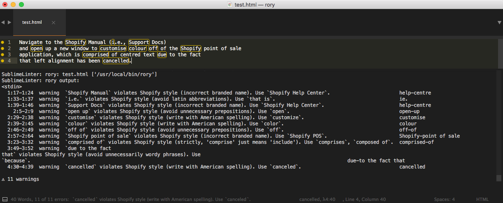

# Sublimelinter-rory

This linter plugin for [**SublimeLinter**](http://www.sublimelinter.com/en/latest/) provides an interface to [**rory**](https://github.com/shopify/rory). It will run automatically on files that have the "plain text, "markdown", "ruby," "html," or "html (rails)"  syntax.

## Installing SublimeLinter

SublimeLinter 3 must be installed in order to use this plugin. Install SublimeLinter 3 through [Package Control](http://www.sublimelinter.com/en/latest/installation.html).

## Installing rory

Before using this plugin, you must ensure that Rory is installed on your system. To install **rory**, visit the readme file in the [**rory**](https://github.com/Shopify/rory) repo and follow the instructions there.

## Installing sublimelinter-rory

1. Navigate to your Sublime packages directory.
    * You can find the location of the packages directory by opening Sublime and navigating to Sublime Text > Preferences > Browse Packages.
2. Clone this repository into your Sublime packages directory using Git.
3. Relaunch Sublime. 

### Set up console output

SublimeLinter sends the linter output to the status bar at the bottom of the screen. This is great if you only have one or two errors per line. But if you have multiple errors the text can run off the screen. The most useful way we've found to display the linter output in Sublime is to also send the stdout to Sublime's console.

1. Right-click on the text in a document.
2. Select SublimeLinter > Debug Mode.
3. Press `ctrl` + `` ` `` to open the console.

